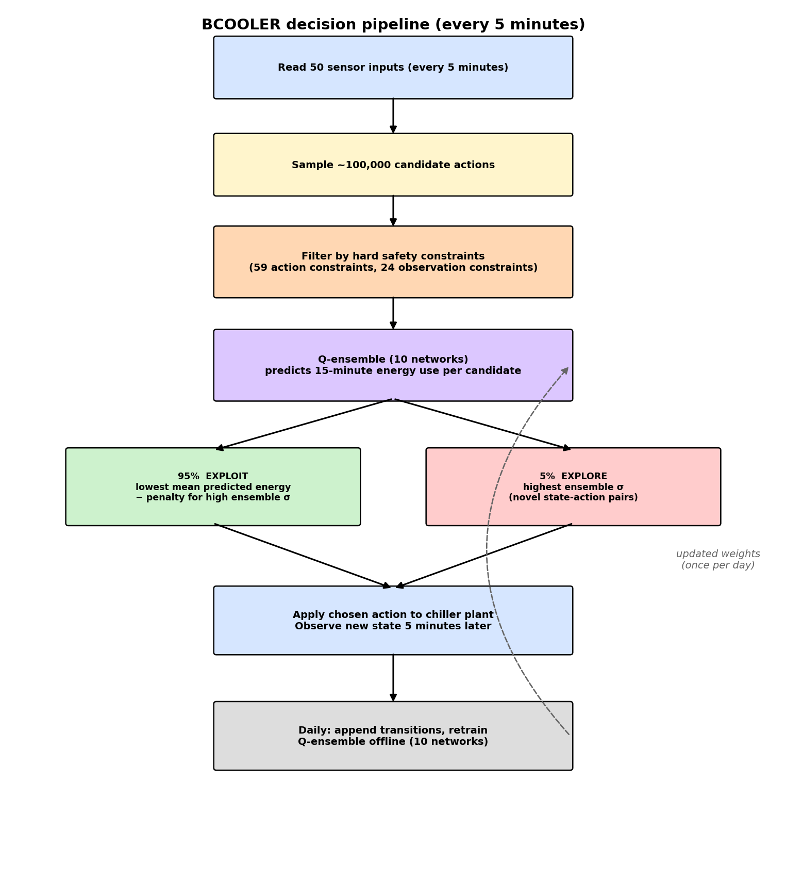
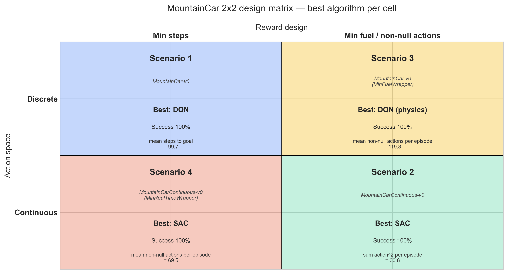

# Part 02 — Real World RL Application Analysis
## DeepMind: Cooling Commercial Buildings with Reinforcement Learning

**Course:** RLI 22.00 — Reinforcement Learning Introduction  
**Programme:** IE University, BCSAI (Spring 2026)  
**Group:** C3B Group 5 — Jack Raja Shawki Samawi · Omar El Hajj Chehade · Salmane Mouhib · Matthew Maingot Gerstein · Enrique Rivela Gómez · Leena Yousef Kamel El-Barq · Nathaniel Nader Ayoub

**Paper reviewed:** Luo et al. (DeepMind & Google), 2022 — *Controlling Commercial Cooling Systems Using Reinforcement Learning*  
**arXiv:** [2211.07357](https://arxiv.org/abs/2211.07357)

---

## Document outline

| § | Section | What it covers |
|---|---|---|
| — | Abstract | Executive summary of the paper and our reason for selecting it |
| 1 | Problem Description | Chiller plants, energy footprint, why static rules fall short |
| 2 | Why Reinforcement Learning? | What makes this problem an RL fit |
| 3 | State Space | The 50 sensor inputs, feature engineering with HVAC experts |
| 4 | Action Space | 12-D mixed action vector + 59/24 hard constraints |
| 5 | Reward Function | Negative energy + CMDP formulation |
| 6 | RL Model and Algorithm (BCOOLER) | Why a custom algorithm; pipeline figure; Q-ensemble |
| 7 | Results | 9% / 13% energy savings, A/B testing setup, learned strategies |
| 8 | Challenges | Data scarcity, sensor drift, constraint elicitation |
| 9 | Lines of Future Development | Six concrete extensions of BCOOLER |
| 10 | Connection to Part 01 (MountainCar) | 2×2 matrix mapping + bidirectional lessons |
| 11 | Conclusions and Assessment | What works, what's limited, "Tinder for RL" framing |
| — | References | BCOOLER paper + supporting RL literature |

---

## Abstract

Commercial HVAC (heating, ventilation, air conditioning) systems consume
roughly 10% of global electricity, and most chiller plants are still
controlled by hand-written rules that cannot adapt to weather, occupancy,
or equipment wear. Luo et al. (DeepMind & Google,
2022) replace one such rule-based controller with a custom reinforcement
learning agent — **BCOOLER** (BVE-based Constrained Optimization Learner with
Ensemble Regularization) — and report **9% and 13% energy savings on two
real commercial buildings** over three months each, with no degradation in
occupant comfort. BCOOLER's individual RL components are deliberately
standard (Q-function, ensemble of 10 networks, exploration via ensemble
disagreement, daily online retraining); what makes the paper notable is
the engineering required to make these components work on a live physical
system with **59 action constraints, 24 observation constraints, sensor
drift, and no simulator** to train in. We selected this paper as a
"best-practice" example because it concretely answers the question that
underlies the assignment's "Tinder for RL" framing: *what does it actually
take to ship reinforcement learning outside a Gym environment?*

---

## 1. Problem Description

Large commercial buildings need HVAC systems to keep the temperature comfortable
for the people inside. The main component we are looking at is the chiller plant,
which cools water and circulates it through the building to remove heat.

The way these systems are normally controlled is through hardcoded rules written
by HVAC engineers, based on their experience and basic physics. The problem with
this approach is that the rules never change. They cannot adapt to things like
shifting weather conditions, how many people are in the building, or equipment
wearing down over time. This leads to a lot of wasted energy.

The goal of this project is to replace these static rules with a Reinforcement
Learning agent that learns to control the chiller plant in a smarter way, using
less energy while still keeping people comfortable and the equipment safe.

To understand why this matters at scale: space cooling alone accounts for around
10% of the world's total electricity demand, so even small efficiency gains in
this area can have a real impact on energy consumption globally.

---

## 2. Why Reinforcement Learning?

The authors make a strong case for why RL is a good fit for this problem:

- **Sequential decisions.** Adjusting a chiller setting now will affect the system
  for the next several minutes or hours, not just the current moment. RL is built
  for exactly this kind of problem where actions have long-term consequences.

- **Clear reward signal.** Energy consumption is measured every 5 minutes, which
  makes it easy to define what "doing well" means for the agent.

- **No need for a physics model.** Methods like Model Predictive Control require
  a detailed mathematical model of each building, which takes a lot of time and
  expertise to build. RL can learn directly from real sensor data instead.

- **Too complex for manual rules.** The right chiller settings depend on dozens
  of variables all interacting with each other, like outside temperature, building
  load, and how many chillers are running. It is very hard to write rules that
  handle all of these combinations well.

---

## 3. State Space

The state is everything the agent can observe about the current situation. In this
case, the agent reads from the building's sensors every 5 minutes. The raw data
contains 176 different sensor measurements, including things like water temperatures,
flow rates, and equipment status (whether certain machines are on or off).

The authors did not use all 176 sensors. Using feature engineering, where
they worked closely with HVAC experts to identify which sensors actually matter,
they narrowed it down to 50 relevant measurements. This was important because using
too many irrelevant inputs makes it harder for the model to learn what actually affects
energy consumption.

Some examples of what the state includes:
- Water temperatures at different points in the system
- Flow rates of the pumps
- Outside weather conditions (temperature, humidity)
- Current building load (how much cooling is needed)
- Equipment status (which chillers and pumps are running)

---

## 4. Action Space

The actions are the controls the agent has available to it at each timestep. The
agent outputs a 12-dimensional vector, meaning it is adjusting 12 different things
at once. Some of these are continuous (a specific temperature or flow rate value)
and some are discrete (turning a piece of equipment on or off).

The full list of what the agent can control includes:

- The temperature setpoint for each chiller (how cold the water should be)
- How many chillers to run at the same time
- The cooling tower temperature setpoint
- The flow rate and number of condenser water pumps
- The chilled water differential pressure
- The number of chilled water pumps
- Whether to use mechanical cooling or free cooling (a more passive mode used
  when outside temperatures are cold enough)

One important detail is that the agent does not have unlimited freedom here. There
are 59 constraints on the actions and 24 constraints on what the sensors are allowed
to read, all defined to protect the equipment and keep people comfortable. The
agent has to find the best action within all of these boundaries.

---

## 5. Reward Function

The reward function is straightforward. At every 5-minute timestep, the agent
receives a reward equal to the negative of the total energy consumed by the
chiller plant during that period. So the more energy used, the more negative
the reward. The agent's goal is to maximize its total reward over time, which
means minimizing energy consumption.

This is a clean and honest reward signal because it directly measures what we
actually care about. There is no need to approximate or engineer a proxy metric
— the energy meter tells you exactly how well the agent is doing.

The agent also has to satisfy a set of constraints alongside this reward. These
are not part of the reward itself but act as hard boundaries the agent cannot
cross, for example keeping the water temperature within a safe range for occupants
and equipment. This makes the problem a constrained optimization rather than a
simple reward maximization.

Formally, this places the problem in the **Constrained Markov Decision Process
(CMDP)** framework rather than a standard MDP — the agent maximises expected
return *subject to* a separate set of hard per-step constraints on auxiliary
state and action signals. This formal distinction matters: as we discuss in
Section 6, it directly motivates BCOOLER's per-candidate constraint filter
over a more conventional reward-penalty approach, because hard CMDP constraints
cannot be reliably encoded as soft penalties when the data budget is small.

---

## 6. RL Model and Algorithm (BCOOLER)

The algorithm developed for this project is called BCOOLER, which stands for
BVE-based Constrained Optimization Learner with Ensemble Regularization
(BVE = *Bellman Value Equation*, the recurrence the Q-function is trained
against). It was built specifically for this problem because no off-the-shelf
RL algorithm was able to handle all the real-world constraints and data
limitations they faced.

### Why a custom algorithm rather than off-the-shelf SAC / PPO / DQN?

The authors note that no standard RL algorithm could satisfy all the
real-world requirements simultaneously:

- **Policy-gradient methods (PPO, SAC)** output actions directly from a
  neural network. Hard safety constraints — like "this water temperature
  must stay in a specific range" or "we cannot turn off both chillers at
  once" — cannot be expressed as a network-architecture invariant, so
  PPO/SAC would either violate them or need a heavy reward-penalty regime
  that the authors found hard to tune in their data-limited setting.
- **Standard DQN** assumes a discrete action space; the chiller plant's
  12-D mixed continuous-discrete action space gives an effectively
  infinite action set that DQN's max-over-actions step does not handle
  natively.
- **Model Predictive Control** (the HVAC industry's preferred non-RL
  approach) requires an accurate physics model of each building, which
  takes months of expert work to build per site. The authors explicitly
  chose RL to avoid this per-building modelling cost.

BCOOLER's action-search approach is the practical compromise: the
constraint check is explicit and per-action rather than baked into the
network, so the agent can never propose an unsafe action — but the
"policy" emerges from scoring candidates rather than being directly
output by a network.

### How it works at a high level

At every 5-minute timestep, the agent goes through the following pipeline:

1. **Read state.** Pull the 50 selected sensor values from the building.
2. **Sample candidates.** Generate ~100,000 candidate actions by sampling
   different combinations of setpoints and discrete on/off decisions.
3. **Constraint filter.** Reject any candidate that is predicted to
   violate one of the 59 action constraints or 24 observation constraints.
4. **Score with the Q-ensemble.** Pass each remaining candidate through
   each of the 10 Q-networks; compute the mean and standard deviation
   of predicted 15-minute energy consumption.
5. **Choose action.** With probability 95%, exploit: pick the candidate
   with the lowest mean predicted energy use, penalised by the ensemble
   standard deviation (so the agent is cautious in unfamiliar regions).
   With probability 5%, explore: pick the candidate with the *highest*
   ensemble standard deviation (so the agent deliberately gathers data
   in regions where the model is uncertain).
6. **Apply action.** Send the selected setpoints to the chiller plant
   and observe the next state 5 minutes later.
7. **Daily retrain.** Once a day, append the new transitions to the
   replay dataset and update the Q-ensemble offline.

*Figure 1 — BCOOLER's decision pipeline at every 5-minute control
step. The orange filter box is what makes BCOOLER different from a
standard SAC/PPO/DQN: hard safety constraints are enforced
*per-candidate-action* (not as a soft penalty in the reward), so the
agent literally cannot propose an unsafe setpoint. The green/red
fork is the ensemble-disagreement exploration mechanism. The dashed
loop on the right is the daily offline retraining step. The figure
is reproducible from `refs/build_paper_review_figs.py`.*

### The Q-function

The Q-function takes a (state, action) pair and predicts how much energy
will be consumed over the next 15 minutes if that action is taken. The
agent uses this to compare candidate actions and pick the one predicted
to use the least energy.

Each Q-function is represented by a neural network with a *multi-tower,
multi-headed* architecture: separate sub-networks predict total energy
consumption and each of the 24 observation constraints, because each
prediction needs different input features to work well.

### The ensemble

Instead of training a single Q-network, the authors train 10 networks
with the same architecture but different random initializations. The
disagreement across the 10 predictions (measured as standard deviation)
is used as a proxy for *epistemic uncertainty* and drives the
exploration-exploitation tradeoff described above. This is essentially
a Bayesian-style uncertainty estimate without the overhead of a full
Bayesian neural network.

### Offline training with daily updates

The agent is not trained in a simulator. It learns directly from real
data collected by the building's sensors. It bootstraps from historical
data collected under the old rule-based controller, then updates its
Q-ensemble every day using the new transitions it generated while in
control. This means the agent gets better over time as it sees more of
the building's behavior and seasonal variation.

---

## 7. Results

The system was tested on two real commercial buildings over a period of 3 months
each, using an A/B testing setup where the RL agent and the old rule-based controller
alternated control day by day. This allowed a fair comparison under similar weather
and load conditions.

| Building | Type | Test duration | Energy savings | Occupant comfort |
|---|---|---|---|---|
| Building 1 | University campus | 3 months | **9%** | maintained |
| Building 2 | Mixed-use commercial | 3 months | **13%** | maintained |

A few interesting patterns came out of the results:

- The agent performed better in cooler weather and at lower building loads. When
  temperatures were high and the building needed maximum cooling, the equipment
  was running close to its limits and there was less room for the agent to be clever
  about its decisions.

- Performance improved over time as the agent collected more data and updated its
  model. This is expected behavior for an agent that retrains daily.

- The agent discovered non-obvious strategies that the rule-based controller never
  used. For example, it learned to set the condenser water temperature lower than
  the baseline in certain situations. This made the cooling towers work harder but
  allowed the chillers to run more efficiently, resulting in lower total energy use.

- The agent also learned to account for sensors that had drifted out of calibration,
  internally adjusting its behavior to compensate for the measurement errors.

It is worth noting that before the experiment started, the existing rule-based
controller was tuned and improved as part of making the facility "AI ready". This
means the baseline the agent was compared against was already better than average,
so the real improvement over a typical untuned system would likely be even higher
than 9-13%.

---

## 8. Challenges

One of the most valuable parts of this paper is how honest the authors are about
the difficulties they faced. Deploying RL in a real physical system is very
different from training an agent in a simulator.

The main challenges they encountered were:

- *Limited data.* The agent had no simulator to train in, so it could only learn
  from real building data collected at 5-minute intervals. Each day only produces
  around 300 data points, which is very little for training a neural network.

- *Noisy and drifting sensors.* Temperature sensors in real buildings drift over
  time and sometimes get recalibrated suddenly, causing large jumps in the data.
  The agent had to be robust to this kind of noise.

- *Complex safety constraints.* The facility managers knew what safe operation
  looked like in practice but had never had to express it mathematically before.
  Translating their knowledge into formal constraints that the agent could use
  took significant back and forth with the HVAC experts at Trane.

- *Real-time decisions.* The agent had to make a decision within 1 minute every
  5 minutes. With 100,000 candidate actions to score through a neural network
  ensemble, this required careful engineering to make fast enough.

- *Non-stationary environment.* The building behaves differently across seasons,
  occupancy patterns change, and equipment performance degrades over time. The
  agent had to continuously adapt rather than relying on a fixed model.

---

## 9. Lines of Future Development

The paper's results are convincing on a single deployment, but several
extensions would test how far this approach generalises:

- **Industrial cooling beyond commercial buildings.** Data centres,
  factories, and supermarket chains all face similar thermal-control
  problems with larger energy budgets. The same Q-function + action-search
  architecture should transfer; the open question is how much per-site
  engineering it needs.
- **Better generalisation across buildings.** BCOOLER trains a separate
  Q-ensemble per building. A natural follow-up is to learn a shared
  backbone with building-specific embeddings, so a new deployment does
  not need to bootstrap from months of historical data.
- **Closing the simulator gap.** The paper explicitly avoids a physics
  simulator because building one per site is too expensive, but a good
  simulator would let the authors run proper ablation studies and iterate
  faster. A hybrid approach (use a coarse simulator for pretraining,
  then daily online updates from real data) could combine the strengths
  of both.
- **Joint optimisation across multiple plants.** BCOOLER controls one
  chiller plant at a time. A district-cooling network with several plants
  could be optimised jointly — the action space grows but the system
  redundancy creates more flexibility for the agent to exploit.
- **Human-in-the-loop constraint refinement.** The paper notes that
  encoding facility-manager intuition into mathematical constraints took
  significant back-and-forth. A more interactive workflow where the agent
  proposes actions and the manager flags unsafe ones would scale this
  better.
- **Richer reward design.** The current reward is purely energy
  consumption. A more nuanced multi-objective reward — energy + comfort
  margin + equipment wear — could trade these off explicitly rather
  than relying on hard constraints to encode them.

---

## 10. Connection to Part 01 (MountainCar)

*Figure 2 — The 2×2 design matrix from Part 01. Each cell names the
scenario, environment, best algorithm, success rate, and primary
cost metric. Both **continuous** scenarios (4 and 2) are won by SAC;
both **discrete** scenarios (1 and 3) are won by DQN-family methods.
The two **adapted-reward** scenarios (3 and 4) both required wrapper
patches — a `+100` goal bonus to defeat the do-nothing exploit, plus
energy-style reward shaping in S3 to break MountainCar's
sparse-reward exploration trap. This figure is generated by
`notebooks/cross_scenario_comparison.ipynb`.*

The MountainCar variants we built in Part 01 are deliberately small,
controllable testbeds for the same RL primitives BCOOLER uses at
industrial scale. The mapping is direct:

| BCOOLER (chiller plant) | Our MountainCar work (Part 01) |
|---|---|
| Q-network ensemble + action search | Q-tables and DQN value heads in scenarios 1 and 3; Q-critics in SAC for scenarios 2 and 4 |
| Reward = negative energy / 5 min (clean, dense) | `-1`/step (S1 dense), `-0.1·a²` (S2 dense), `-1` per non-null action (S3/S4 sparse, plus engineered goal bonus) |
| Sparse improvement signal early on (small day-to-day differences) | Hit the sparse-reward exploration problem head-on in S3, where vanilla DQN/PPO/A2C never reached the goal during random exploration; required energy-style reward shaping to break the "do nothing" trap |
| Ensemble disagreement drives exploration | State-Dependent Exploration (SDE) noise in SAC (S2/S4), ε-greedy schedule in DQN (S1/S3) — coarser uncertainty heuristics |
| 59 action + 24 observation hard safety constraints | No constraints: action ∈ [-1, 1] continuous or {0, 1, 2} discrete with no notion of "unsafe" |
| 3 months of A/B testing on a live facility | 100-episode deterministic eval against a fixed Gym env |

The most direct lesson BCOOLER carries for our MountainCar work is the
**uncertainty-driven exploration-exploitation tradeoff**. We use much
simpler heuristics — a fixed `exploration_fraction` and `exploration_final_eps`
schedule for DQN, SDE for SAC — but the underlying question is the same:
*how do you collect enough diverse data to learn the right value function
without doing damage in the meantime?* On MountainCar "damage" is just
truncated episodes; on a chiller plant it means uncomfortable occupants
or worn-out compressors. The cost of a bad action is much higher in the
real world, which is why BCOOLER spends so much engineering on its
constraint filter and ensemble-disagreement penalty.

The reverse direction is also instructive: our scenario 3 + 4 work shows
that even toy environments can have nasty reward-design pathologies (the
"do-nothing" exploit, the on-policy oscillation trap) that disappear
once shaping or a goal bonus is added. Industrial deployments cannot
afford to discover such pathologies post-hoc — which is precisely why
BCOOLER's authors invested in the constraint architecture before
turning the agent on.

---

## 11. Conclusions and Assessment

This project is a strong example of what it takes to apply RL successfully outside
of a controlled research environment. The core RL concepts are relatively standard
— the Q-function, ensemble networks, and the exploration-exploitation tradeoff
are all well-established ideas. What makes this work interesting is the engineering
effort required to make them work reliably on a real physical system with safety
constraints, noisy data, and no simulator.

The results are meaningful. A 9-13% reduction in energy consumption across two
different types of commercial buildings, while maintaining occupant comfort, shows
that the approach generalizes and is not just tuned to one specific building.

From an RL perspective, the most notable design choice is the action search approach.
Rather than using a policy network that directly outputs an action, the agent generates
thousands of candidate actions and scores them with the Q-function. This was necessary
because the complex safety constraints made it very hard to build a policy network
whose outputs would always be safe. It is a practical and honest tradeoff between
theoretical elegance and real-world reliability.

The biggest limitation of the paper is that the authors could not run proper ablation
studies, meaning they could not isolate and measure the contribution of each individual
design choice. This is a direct consequence of deploying on a live system where you
cannot run two versions of the agent at the same time. It is an honest admission but
it does make it harder to know which parts of BCOOLER actually matter most.

In the broader context of the "Tinder for RL" framing this assignment uses —
*find the right RL solution candidate for a given environment* — BCOOLER's
lesson is that the match-making criteria for industrial RL are very
different from research benchmarks. The "best" algorithm is the one that
respects the constraints, learns from limited data, and degrades safely
when wrong, not necessarily the one with the best reward curve in a
simulator. Off-the-shelf SAC or PPO would both lose this match purely
on safety grounds, regardless of how well they would perform if
unleashed in a Gym version of the same environment.

---

## References

1. Luo, J., Paduraru, C., Voicu, O., Chervonyi, Y., Munns, S., Li, J., Qian, C.,
   Dutta, P., Davis, J. Q., Wu, N., Yang, X., Chang, C.-M., Li, T., Rose, R.,
   Fan, M., Nakhost, H., Liu, T., Kirkman, B., Altamura, F., … Faust, A. (2022).
   *Controlling Commercial Cooling Systems Using Reinforcement Learning.*
   arXiv:2211.07357. https://arxiv.org/abs/2211.07357 — the paper reviewed in
   this document.

2. Schulman, J., Wolski, F., Dhariwal, P., Radford, A., & Klimov, O. (2017).
   *Proximal Policy Optimization Algorithms.* arXiv:1707.06347 — PPO baseline
   compared against in Section 6 and used in Part 01 scenarios 2 and 4.

3. Haarnoja, T., Zhou, A., Abbeel, P., & Levine, S. (2018). *Soft Actor-Critic:
   Off-Policy Maximum Entropy Deep Reinforcement Learning with a Stochastic
   Actor.* ICML 2018. arXiv:1801.01290 — SAC baseline compared against in
   Section 6 and the winning algorithm for Part 01 scenarios 2 and 4.

4. Mnih, V., Kavukcuoglu, K., Silver, D., et al. (2015). *Human-level control
   through deep reinforcement learning.* *Nature*, 518(7540), 529–533 —
   original DQN paper underlying the Q-learning machinery used in BCOOLER's
   Q-ensemble and in Part 01 scenarios 1 and 3.

5. Camacho, E. F., & Bordons, C. (2007). *Model Predictive Control* (2nd ed.).
   Springer — standard reference for MPC, the HVAC industry's preferred non-RL
   approach that BCOOLER is contrasted against in Section 6.

6. Altman, E. (1999). *Constrained Markov Decision Processes.* Chapman &
   Hall / CRC — formal reference for the CMDP framework introduced in
   Section 5.

7. Ng, A. Y., Harada, D., & Russell, S. J. (1999). *Policy Invariance Under
   Reward Transformations: Theory and Application to Reward Shaping.* ICML
   1999 — theoretical justification for the energy-style reward shaping used
   in our Part 01 scenarios 1 and 3.

8. Rückstieß, T., Felder, M., & Schmidhuber, J. (2008). *State-Dependent
   Exploration for Policy Gradient Methods.* ECML PKDD 2008 — the SDE
   exploration mechanism used by SAC in Part 01 scenarios 2 and 4 and
   referenced in Section 10.

9. Sutton, R. S., & Barto, A. G. (2018). *Reinforcement Learning: An
   Introduction* (2nd ed.). MIT Press — standard textbook reference for
   the Q-function, Bellman equations, and the exploration-exploitation
   tradeoff that underlie BCOOLER's design.

10. Raffin, A., Hill, A., Gleave, A., Kanervisto, A., Ernestus, M., &
    Dormann, N. (2021). *Stable-Baselines3: Reliable Reinforcement Learning
    Implementations.* JMLR 22(268):1–8. https://github.com/DLR-RM/stable-baselines3
    — the SB3 library and RL Zoo hyperparameter recipes used to train every
    Part 01 baseline that this paper review is contrasted against.
